---
## Author
author:
  name: Селиванов Вячеслав Алексеевич
  degrees: DSc
  orcid: 0000-0002-0877-7063
  email: selivanow2000@mail.ru
  affiliation:
    - name: Российский университет дружбы народов
      country: Российская Федерация
      postal-code: 117198
      city: Москва
      address: ул. Миклухо-Маклая, д. 6
## Title
title: Структура научной презентации
subtitle: Простейший вариант
license: CC BY
date: today
date-format: "YYYY-MM-DD" # Example: 2025-09-06
---

## Докладчик

:::::::::::::: {.columns align=center}
::: {.column width="70%"}

  * Селиванов Вячеслав Алексеевич

:::
::: {.column width="30%"}

:::
::::::::::::::

## Актуальность

- Создать окружение для будущих работ
- познакомиться с новым ПО

## Цели и задачи

Подготовить среду для работы с моделированием, подключить необходимое окружение, провести пару пробных тестов.

##

Для начала создадим репозиторий и склонируем его к себе на устройство.Перейдем в каталог курса

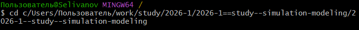

##

Инициализируем курс

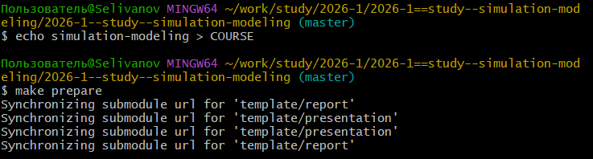

##

Отправим файлы на сервер

##

Инициализируем git-flow

##

Проверяем, что находимся на ветке develop

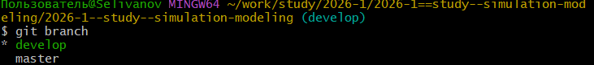

##

Загружаем весь репозиторий в хранилище

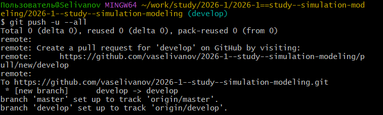

##

Создадим релиз с версией 1.0.0

##

Создадим журнал изменений

##

Добавим журнал изменений в индекс

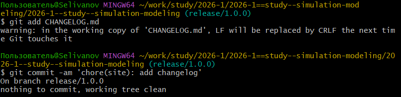

##

Зальём релизную ветку в основную ветку

##

Отправим данные на github

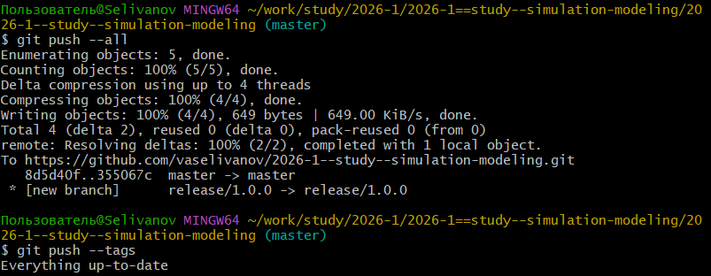

##

Скопируем CHANGELOG.md в каталог release

##

Создадим релиз

##

Перейдем в каталог лабы, откроем julia и выполним предложенный код

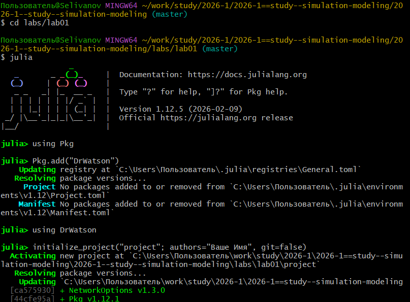

##

Перейдем в созданный каталог

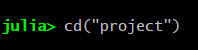

##

Установим необходимые пакеты через скрипт

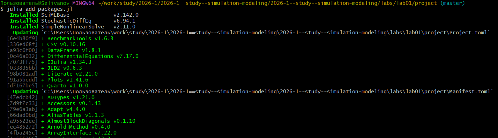

##

Проверим установку через скрипт

##

Выполним скрипт из лабораторной работы

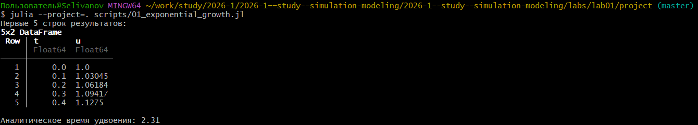

##

График после выполнения первого скрипта

##

Создадим производные форматы

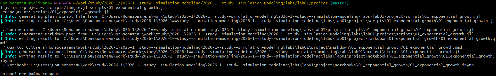

##

Включим поддержку кода julia

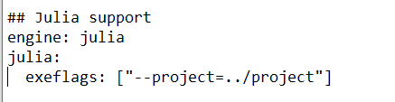

##

Изменим программу так, чтобы она принимала набор параметров.

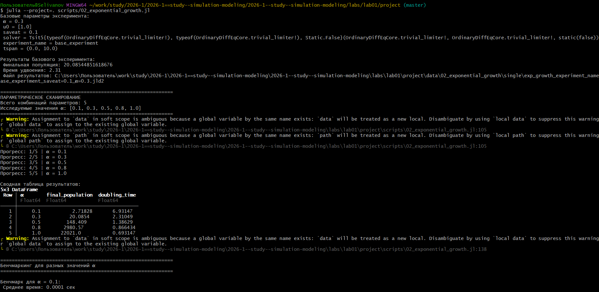

##

Создадим производные форматы

##

График зависимости времени вычисления

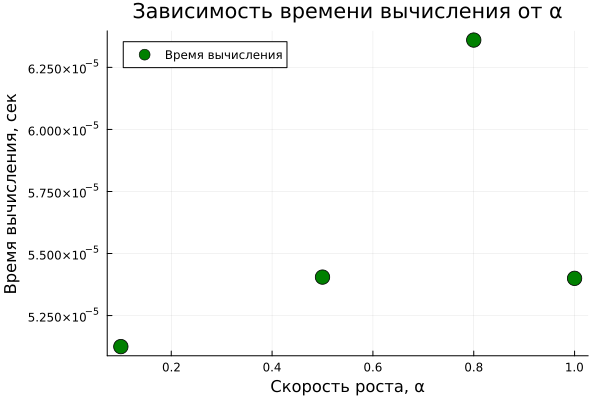

##

График зависимости времени удвоения

##

Параметрическое исследование

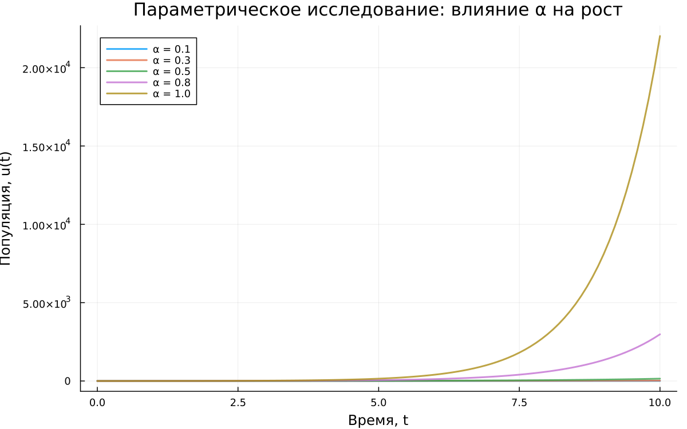

##

Базовый эксперимент

## 
Выводы: В данной работе мы создали необходимое окружение и подключили нужные функции для будущих работ, а так же попробовали создать некоторые примеры.