---
## Author
author:
  name: Селиванов Вячеслав Алексеевич
  degrees: DSc
  orcid: 0000-0002-0877-7063
  email: selivanow2000@mail.ru					
  affiliation:
    - name: Российский университет дружбы народов
      country: Российская Федерация
      postal-code: 117198
      city: Москва
      address: ул. Миклухо-Маклая, д. 6

## Title
title: "Лабораторная работа №1"
subtitle: ""
license: "CC BY"
---

# Цель работы

Подготовить среду для работы с моделированием, подключить необходимое окружение, провести пару пробных тестов.

# Задание

Подготовить среду для работы с моделированием, подключить необходимое окружение, провести пару пробных тестов.

# Выполнение лабораторной работы

Для начала создадим репозиторий и склонируем его к себе на устройство.Перейдем в каталог курса ([рис. @fig-001]).

{#fig-001 width=70%}

Инициализируем курс ([рис. @fig-002]).

{#fig-002 width=70%}

Отправим файлы на сервер ([рис. @fig-003]).

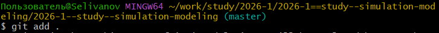{#fig-003 width=70%}
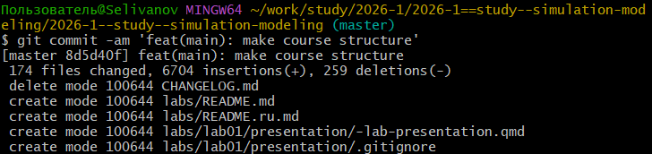{#fig-004 width=70%}
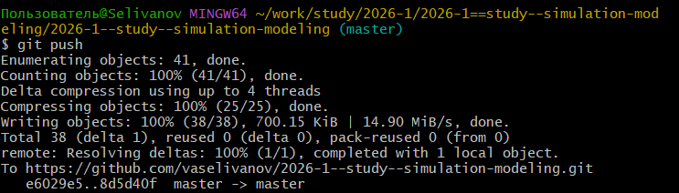{#fig-005 width=70%}

Инициализируем git-flow ([рис. @fig-006]).

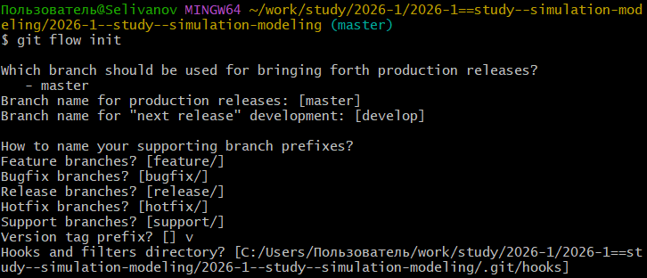{#fig-006 width=70%}

Проверяем, что находимся на ветке develop ([рис. @fig-007]).

{#fig-007 width=70%}

Загружаем весь репозиторий в хранилище ([рис. @fig-008]).

{#fig-008 width=70%}

Создадим релиз с версией 1.0.0 ([рис. @fig-009]).

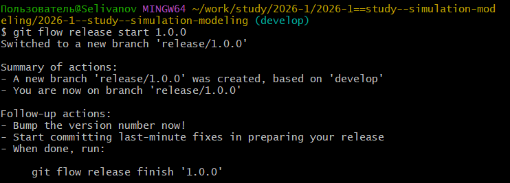{#fig-009 width=70%}

Создадим журнал изменений ([рис. @fig-010]).

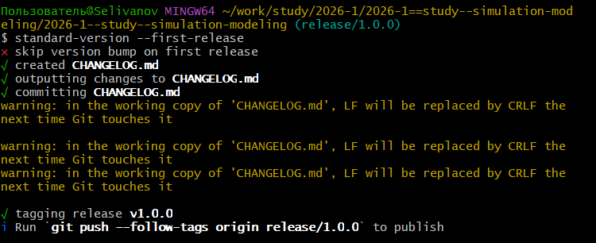{#fig-010 width=70%}

Добавим журнал изменений в индекс ([рис. @fig-011]).

{#fig-011 width=70%}

Зальём релизную ветку в основную ветку ([рис. @fig-012]).

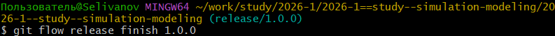{#fig-012 width=70%}

Отправим данные на github ([рис. @fig-013]).

{#fig-013 width=70%}

Скопируем CHANGELOG.md в каталог release: ([рис. @fig-014]).

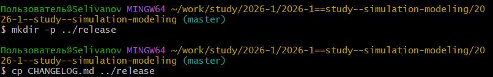{#fig-014 width=70%}

Создадим релиз: ([рис. @fig-015]).

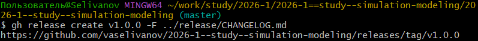{#fig-015 width=70%}

Перейдем в каталог лабы, откроем julia и выполним предложенный код: ([рис. @fig-016]).

{#fig-016 width=70%}

Перейдем в созданный каталог: ([рис. @fig-017]).

{#fig-017 width=70%}

Установим необходимые пакеты через скрипт: ([рис. @fig-018]).

{#fig-018 width=70%}

Проверим установку через скрипт: ([рис. @fig-019]).

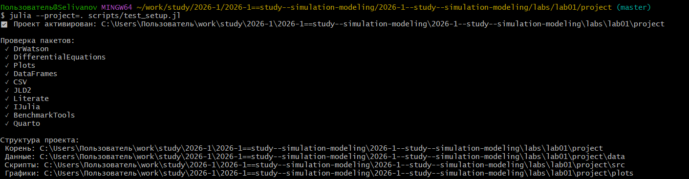{#fig-019 width=70%}

Выполним скрипт из лабораторной работы: ([рис. @fig-020]).

{#fig-020 width=70%}

График после выполнения первого скрипта: ([рис. @fig-021]).

{#fig-021 width=70%}

Создадим производные форматы: ([рис. @fig-022]).

{#fig-022 width=70%}



Включим поддержку кода julia: ([рис. @fig-023]).

{#fig-023 width=70%}

Изменим программу так, чтобы она принимала набор параметров.: ([рис. @fig-024]).

{#fig-024 width=70%}

Создадим производные форматы: ([рис. @fig-025]).

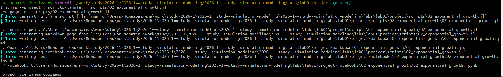{#fig-025 width=70%}



Графики после выполнения второго скрипта: ([рис. @fig-026]).

{#fig-026 width=70%}
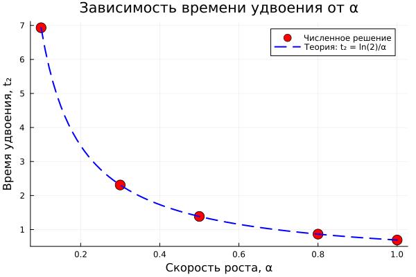{#fig-027 width=70%}
{#fig-028 width=70%}
{#fig-029 width=70%}

# Выводы

В данной работе мы создали необходимое окружение и подключили нужные функции для будущих работ, а так же попробовали создать некоторые примеры.

