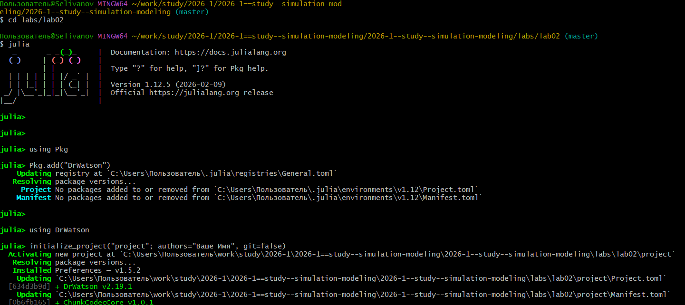
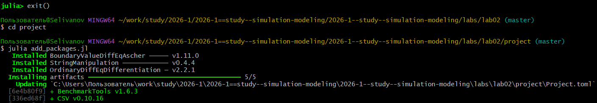
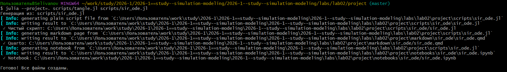
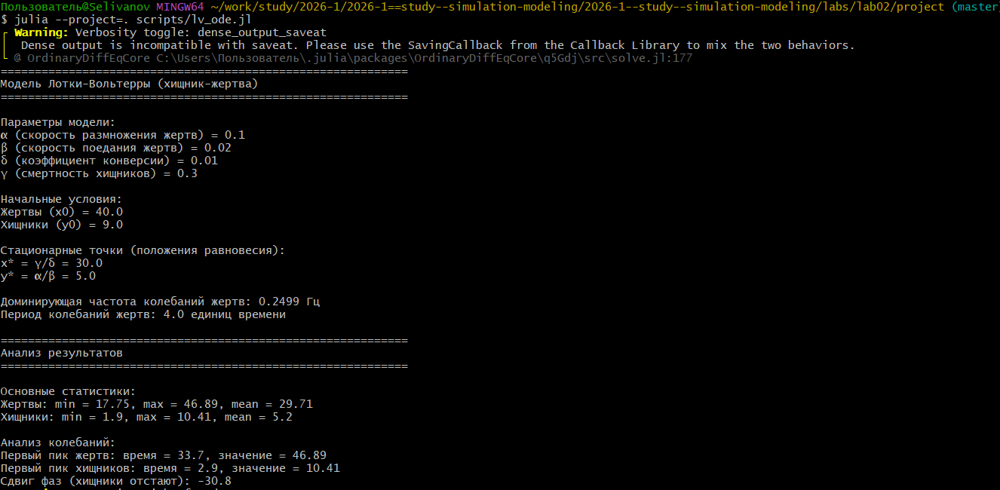
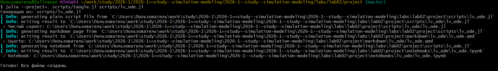
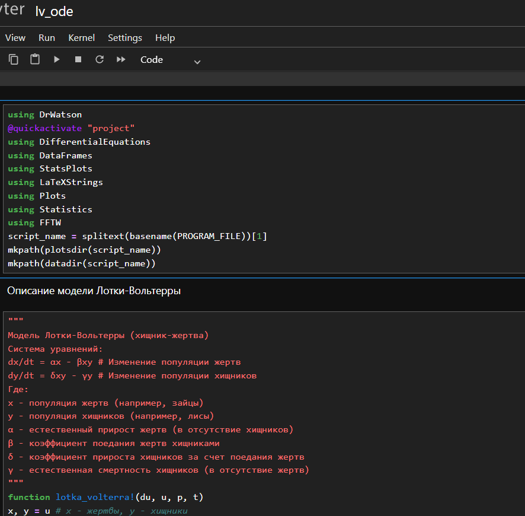
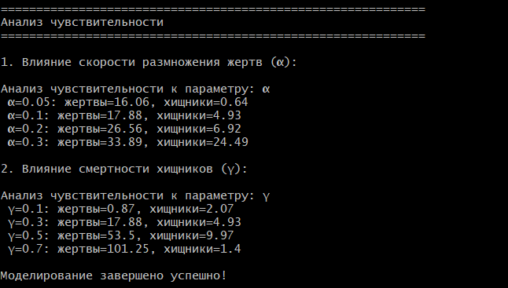
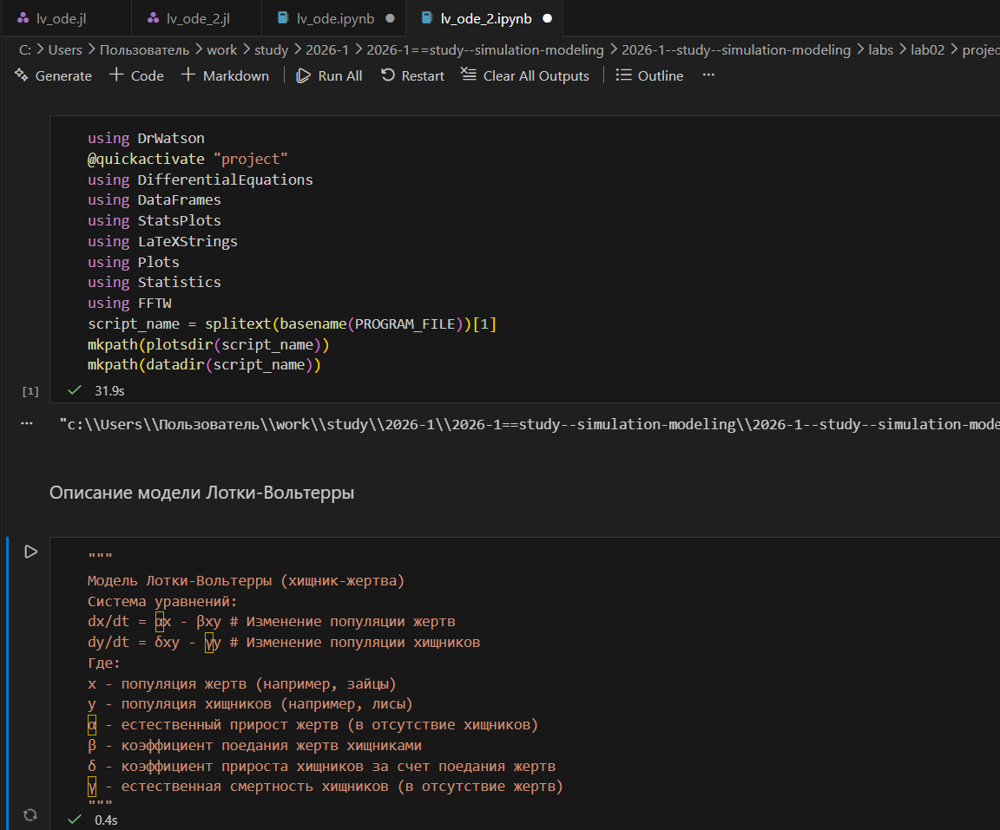
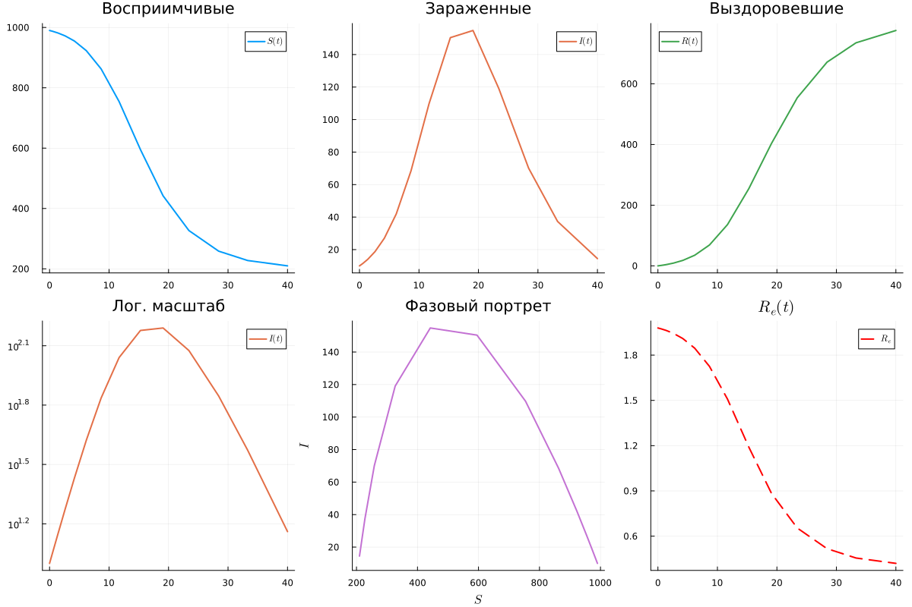
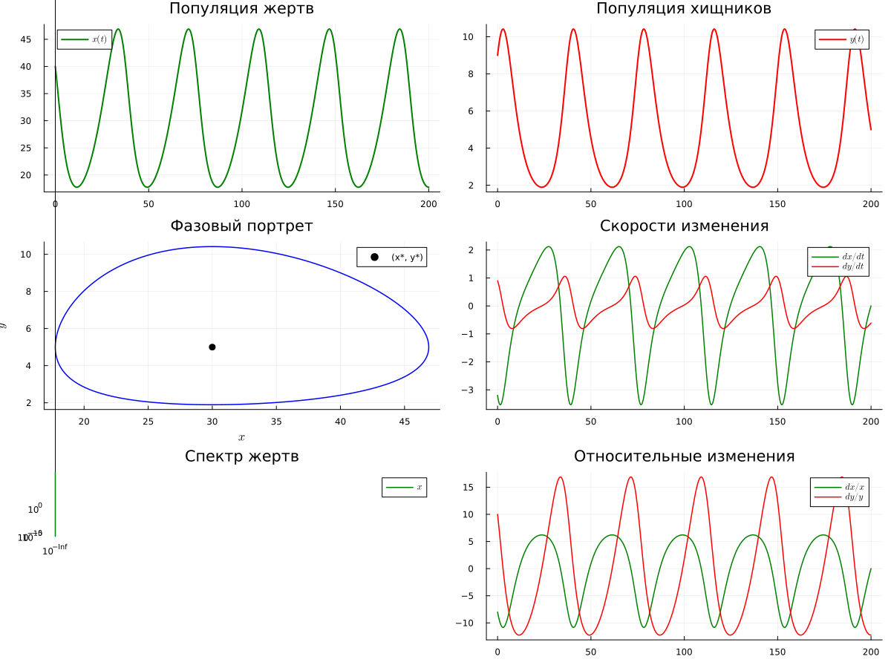

---
## Author
author:
  name: Селиванов Вячеслав Алексеевич
  degrees: DSc
  orcid: 0000-0002-0877-7063
  email: 1132236027@rudn.ru
  affiliation:
    - name: Российский университет дружбы народов
      country: Российская Федерация
      postal-code: 117198
      city: Москва
      address: ул. Миклухо-Маклая, д. 6
## Title
title: Структура научной презентации
subtitle: Простейший вариант
license: CC BY
date: today
date-format: "2026-03-07" # Example: 2025-09-06
---

# Информация

## Докладчик

:::::::::::::: {.columns align=center}
::: {.column width="70%"}

  * Селиванов Вячеслав Алексеевич

:::
::: {.column width="30%"}

:::
::::::::::::::

## Актуальность

- Математические модели Sir и Лотки-Вольтерры прогнозируют скорость распространения эпидемии и популяции хищников и жертв в закрытой среде соответсвенно

## Объект и предмет исследования

Модели SIR и Лотки-Вольтерры

## Цели и задачи

Изучить модели SIR и Лотки-Вольтерры, создать скрипты, реализующие данные модели, проанализировать полученные результаты

## Выполнение лабораторной работы

Создаем рабочий каталог и инициализируем проект в julia.

## 

Добавляем необходимые пакеты.

## 

Создадим скрипт для работы с моделью SIR и запустим его.

## 

Создадим производные форматы.

## 

Проверим файл для Jupyter.

## 

Создадим скрипт для работы с моделью Лотки-Вольтерры и запустим его.

## 

Создадим производные форматы.

## 

Проверим файл для Jupyter для модели Лотки-Вольтерры.

## 

Изменим скрипт, чтобы он перебирал параметры альфа и гамма и проанализируем чувствительность к этим параметрам.

## 

Создадим производные форматы для модели с перебором параметров.

## 

Выполненим файл .ipynb в Jupyter.

## 

Графики для модели SIR.

## 

Графики для модели Лотки-Вольтерры.

## Выводы
В ходе данной лабораторной работы я познакомился с основными моделями, такими как SIR и модель Лотки-Вольтерры.
Я узнал где они применяются. Так же провел анализ чувствительности модели к параметрам.

