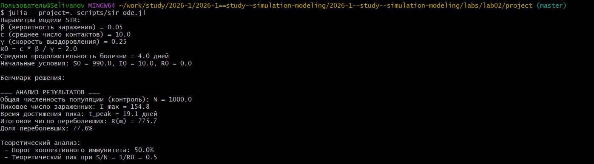
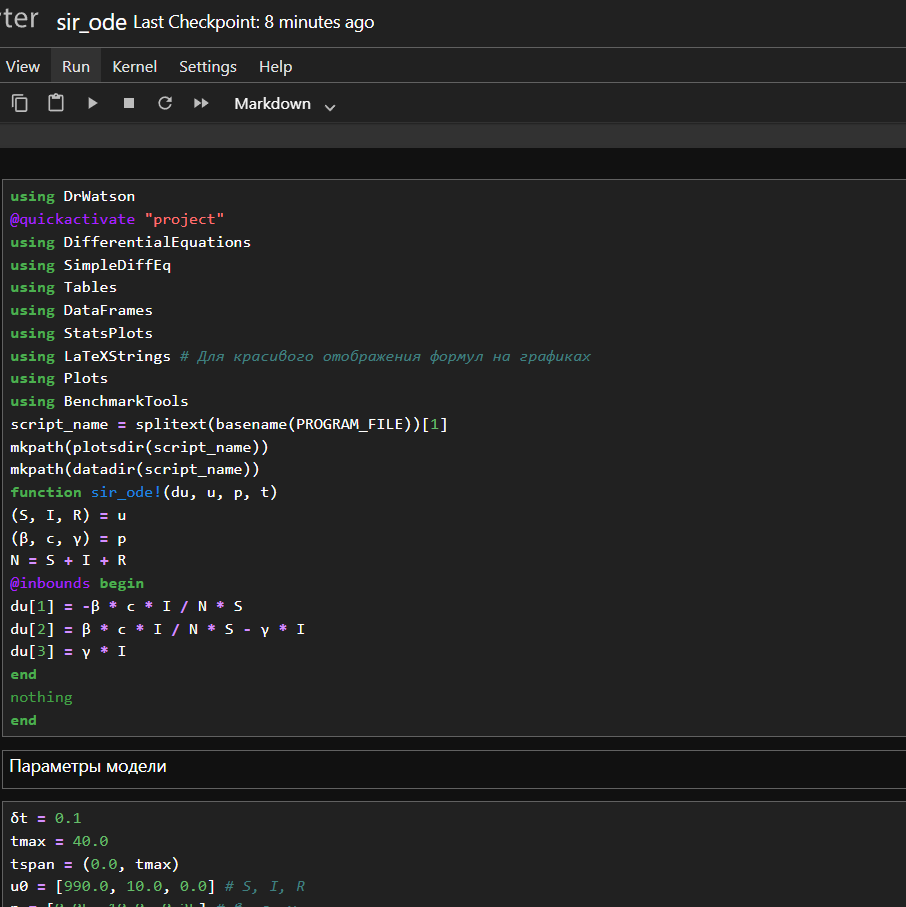
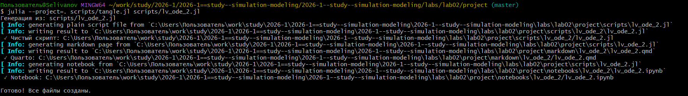

---
## Author
author:
  name: Селиванов Вячеслав Алексеевич
  degrees: DSc
  orcid: 0000-0002-0877-7063
  email: 1132236027@rudn.ru
  affiliation:
    - name: Российский университет дружбы народов
      country: Российская Федерация
      postal-code: 117198
      city: Москва
      address: ул. Миклухо-Маклая, д. 6

## Title
title: "Отчёт по лабораторной работе №2"
subtitle: "Модели SIR и Лотки-Вольтерры"
license: "CC BY"
---

# Цель работы

Изучить и проанализировать модели SIR и Лотки-Вольтерры

# Задание

Создать скрипты, анализирующие и визуализирующие две основные модели: SIR и модель Лотки-Вольтерры

# Теоретическое введение

SIR

Модель SIR делит всю популяцию на три взаимосвязанные группы (компартменты), что отражено в её названии:
— 𝑆 — Susceptible (Восприимчивые): люди, которые не болели, не имеют иммунитета и могут заразиться.
— 𝐼 — Infectious (Инфицированные/Заразные): люди, которые в данный момент
больны и могут передавать инфекцию.
— 𝑅 — Recovered (Выздоровевшие/Удаленные): люди, которые переболели и приобрели иммунитет (или умерли). Они больше не участвуют в передаче

Основная цель модели: не предсказать судьбу конкретного человека, а понять
общую динамику эпидемии — будет ли она разрастаться, как быстро, сколько
людей в итоге переболеет, как влияют карантинные меры
1. Уравнение для восприимчивых (𝑆):
𝑑𝑆
𝑑𝑡 = −𝛽𝐼𝑆/N
2. Уравнение для заразных (𝐼):
𝑑𝐼
𝑑𝑡 = 𝛽𝐼𝑆/𝑁 − 𝛾I

3. Уравнение для выздоровевших (𝑅):
𝑑𝑅
𝑑𝑡 = 𝛾I

Модель Лотки-Вольтерры

Модель Лотки-Вольтерры — это фундаментальная математическая модель в экологии, описывающая динамику взаимодействия двух видов: хищников и жертв
Уравнение для популяции жертв (x)
𝑑𝑥
𝑑𝑡 = 𝛼𝑥 − 𝛽𝑥y
Уравнение для популяции хищников (y)
𝑑𝑦
𝑑𝑡 = 𝛿𝑥𝑦 − 𝛾y

# Выполнение лабораторной работы

Создадим проект для лабораторной работы ([рис. @fig-001]).

{#fig-001 width=70%}

Добавляем необходимые пакеты ([рис. @fig-002]).

{#fig-002 width=70%}

Создадим скрипт для работы с моделью SIR и запустим его ([рис. @fig-003]).

{#fig-003 width=70%}

Создадим производные форматы ([рис. @fig-004]).

{#fig-004 width=70%}

Проверим файл для Jupyter ([рис. @fig-005]).

{#fig-005 width=70%}

Создадим скрипт для работы с моделью Лотки-Вольтерры и запустим его ([рис. @fig-006]).

{#fig-006 width=70%}

Создадим производные форматы ([рис. @fig-007]).

{#fig-007 width=70%}

Проверим файл для Jupyter для модели Лотки-Вольтерры ([рис. @fig-008]).

{#fig-008 width=70%}

Изменим скрипт, чтобы он перебирал параметры альфа и гамма и проанализируем чувствительность к этим параметрам ([рис. @fig-009]).

{#fig-009 width=70%}

Создадим производные форматы для модели с перебором параметров ([рис. @fig-010]).

{#fig-010 width=70%}

Выполненим файл .ipynb в Jupyter ([рис. @fig-011]).

{#fig-011 width=70%}





# Выводы

В ходе данной лабораторной работы я познакомился с основными моделями, такими как SIR и модель Лотки-Вольтерры.
Я узнал где они применяются. Так же провел анализ чувствительности модели к параметрам.

# Список литературы{.unnumbered}

::: {#Текст Лабораторной работы №2}
:::
