---
## Author
author:
  name: Селиванов Вячеслав Алексеевич
  degrees: DSc
  orcid: 0000-0002-0877-7063
  email: 1132236027@rudn.ru
  affiliation:
    - name: Российский университет дружбы народов
      country: Российская Федерация
      postal-code: 117198
      city: Москва
      address: ул. Миклухо-Маклая, д. 6
## Title
title: Презентация по лабораторной работе №3
subtitle: Агентное моделирование
license: CC BY
date: today
date-format: "2026-03-07" # Example: 2025-09-06
---

# Информация

## Докладчик

:::::::::::::: {.columns align=center}
::: {.column width="70%"}

  * Селиванов Вячеслав Алексеевич

:::
::: {.column width="30%"}

:::
::::::::::::::

# Вводная часть

## Актуальность

С помощью агентного подхода можно моделировать поведение нелинейных систем

## Объект и предмет исследования

Агентный подход на примере модели DaisyWorld

## Цели и задачи

Изучить агентный подход на примере модели DaisyWorld

## Выполнение лабораторной работы

Создаем рабочий каталог и инициализируем проект в julia.

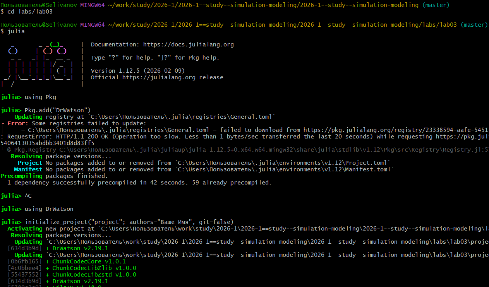

##

Загрузим необходимые пакеты.

##

В папке src создадим файл описывающий агента, далее в папке scripts создадим скрипт с предложенным кодом, выполняющим базовую визуализацию.

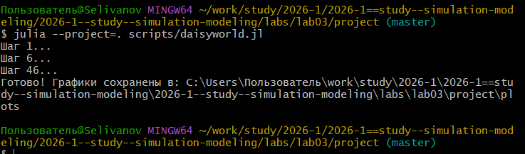

##

Создадим производные форматы.

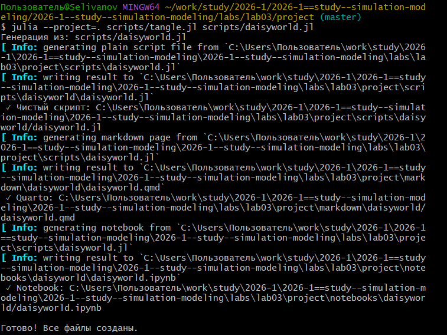

##

Проверим работоспособность файла .ipynb.

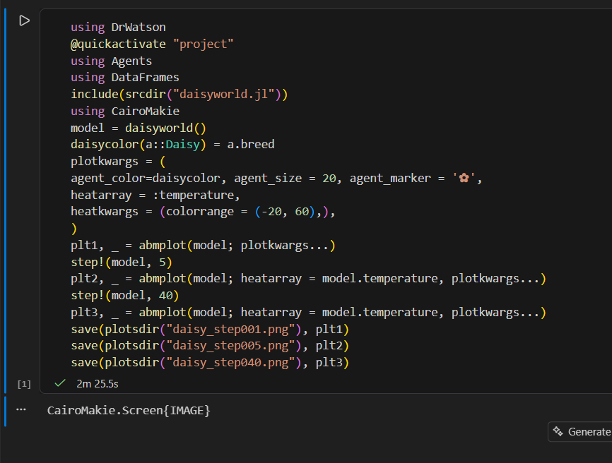

##

Анимируем базовую визуализацию с помощью скрипта.

##

Выполним скрипт для визуализации динамики изменения числа маргариток.

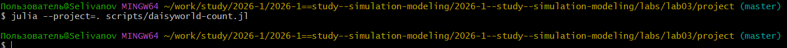

##

Создадим производные форматы.

##

Проверим работоспособность файла .ipynb.

##

Построим комплексный график числа маргариток, температуры и альбедо в зависимости от времени.

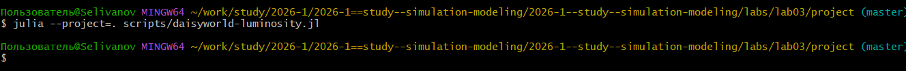

##

Создадим производные форматы.

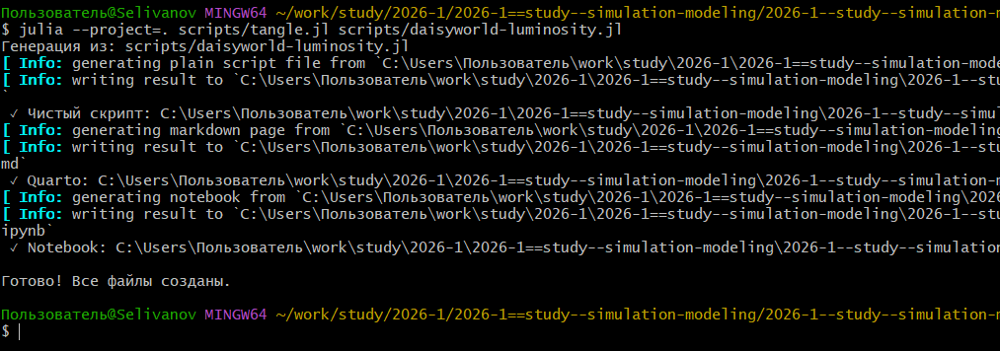

##

Проверим работоспособность файла .ipynb.

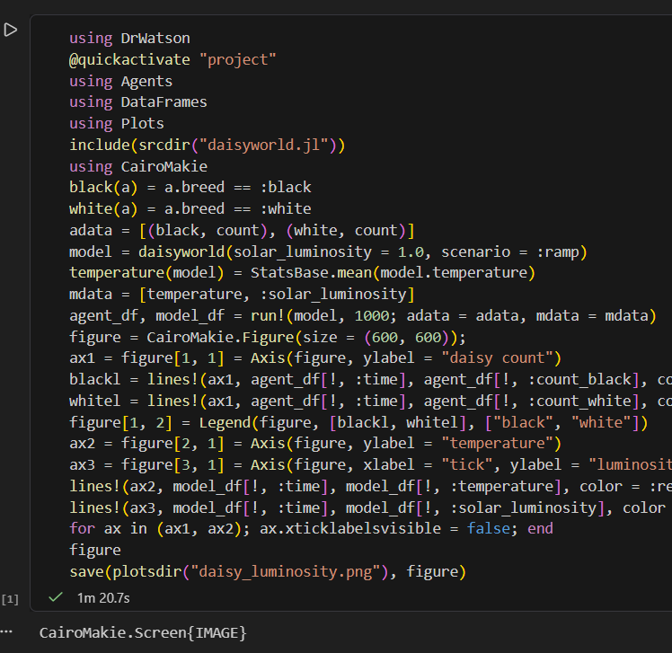

##

Выполним базовую визуализацию с параметрами.

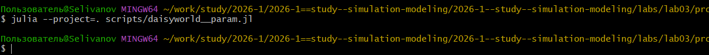

##

Создадим производные форматы.

##

Проверим работоспособность файла .ipynb.

##

Выполним скрипт для визуализации динамики изменения числа маргариток с перебором параметров.

##

Создадим производные форматы.

##

Проверим работоспособность файла .ipynb.

##

Построим комплексные графики числа маргариток, температуры и альбедо в зависимости от времени с перебором параметров, создадим производные форматы.

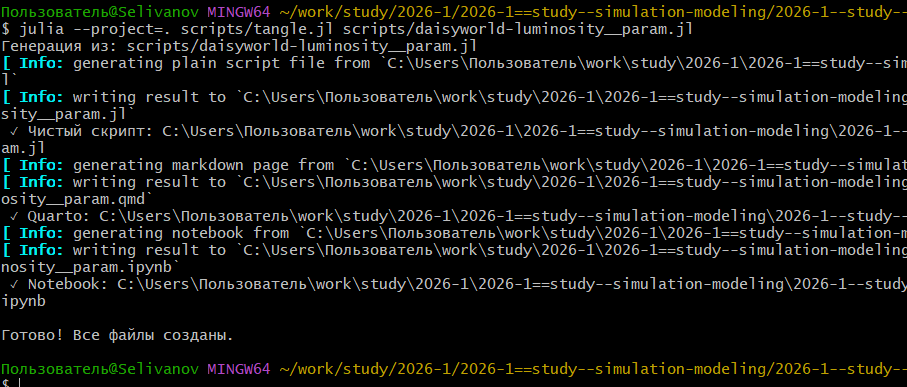

##

Проверим работоспособность файла .ipynb.

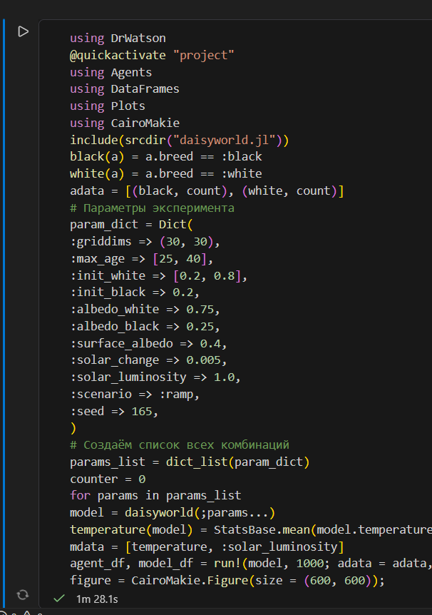

##

Проанализируем комплексный график.

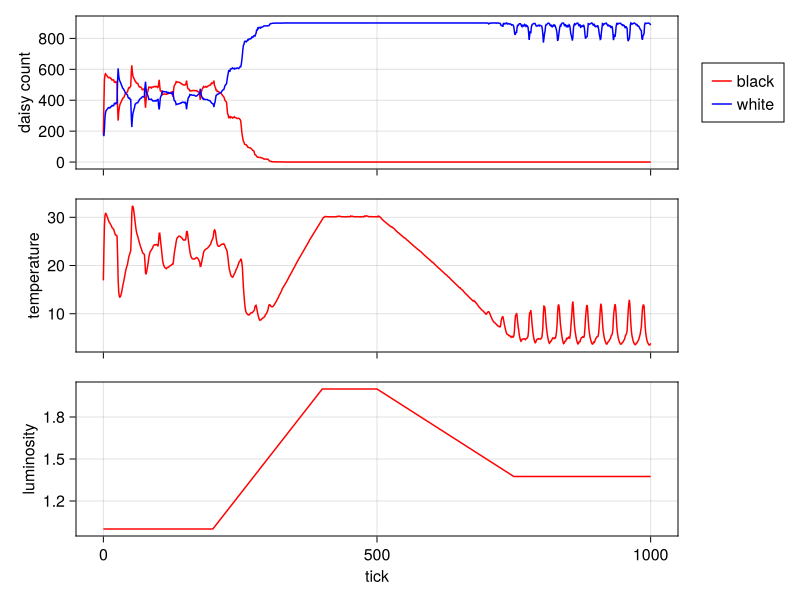

## Выводы
В данной лабораторной работе я познакомился с агентным моделированием и моделью DaisyWorld, а так же построил их визуализацию.

