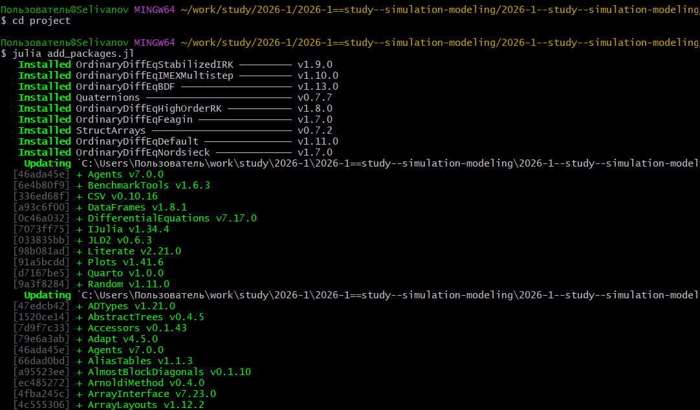
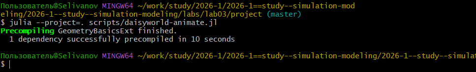
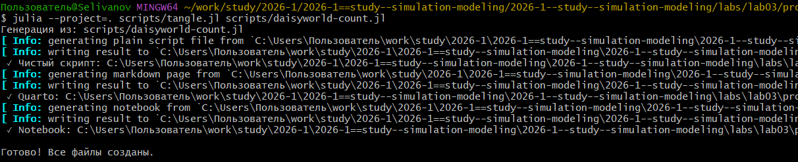
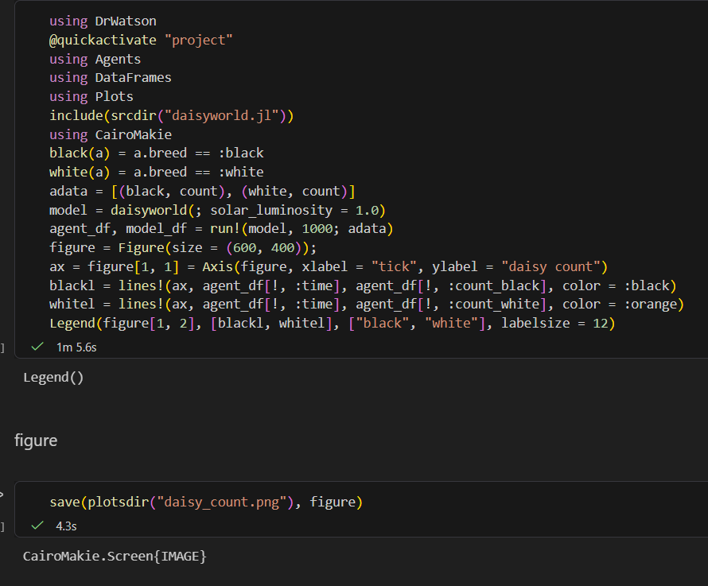
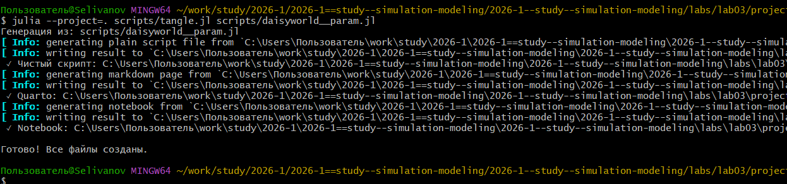
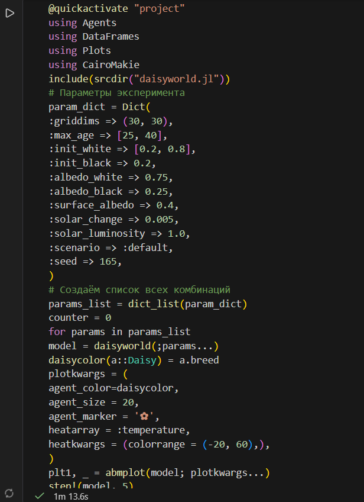
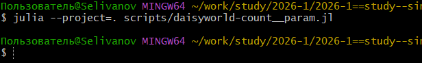
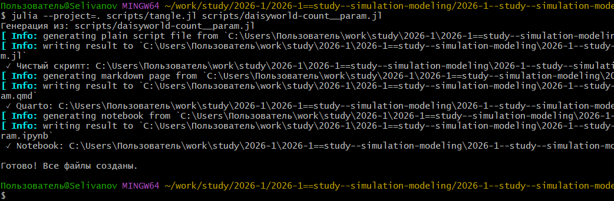
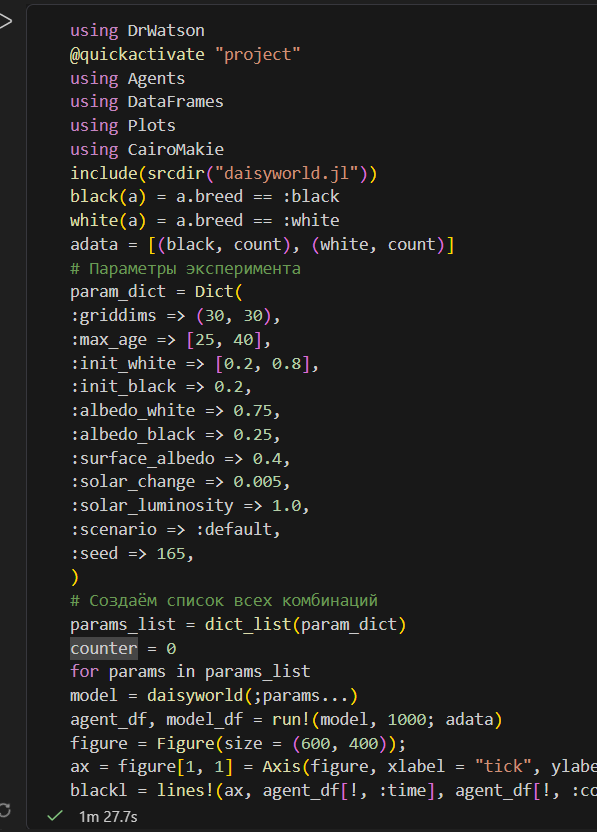

---
## Author
author:
  name: Селиванов Вячеслав Алексеевич
  degrees: DSc
  orcid: 0000-0002-0877-7063
  email: 1132236027@rudn.ru
  affiliation:
    - name: Российский университет дружбы народов
      country: Российская Федерация
      postal-code: 117198
      city: Москва
      address: ул. Миклухо-Маклая, д. 6

## Title
title: "Отчёт по лабораторной работе №3"
subtitle: "Агентное моделирование"
license: "CC BY"
---

# Цель работы

Изучить и проанализировать агентный подход

# Задание

Создать скрипты визуализирующие модель DaisyWorld

# Теоретическое введение

Агентный подход к имитационному моделированию (Agent-Based Modeling, ABM)
— это метод исследования сложных систем, в котором поведение системы возникает из взаимодействия множества автономных сущностей, называемых агентами.
Вместо того чтобы описывать систему глобальными уравнениями, мы моделируем каждую индивидуальную единицу и правила её поведения, а затем наблюдаем,
какие коллективные паттерны появляются снизу вверх. Этот подход особенно
полезен, когда поведение системы трудно предсказать из-за нелинейностей, гетерогенности участников или адаптивных стратегий.

# Выполнение лабораторной работы

Создадим рабочее пространство и инициализируем проект ([рис. @fig-001]).

{#fig-001 width=70%}

Загрузим необходимые пакеты ([рис. @fig-002]).

{#fig-002 width=70%}

В папке src создадим файл описывающий агента, далее в папке scripts создадим скрипт с предложенным кодом, выполняющим базовую визуализацию ([рис. @fig-003]).

{#fig-003 width=70%}

Создадим производные форматы ([рис. @fig-004]).

{#fig-004 width=70%}

Проверим работоспособность файла .ipynb ([рис. @fig-005]).

{#fig-005 width=70%}

Анимируем базовую визуализацию с помощью скрипта ([рис. @fig-006]).

{#fig-006 width=70%}

Выполним скрипт для визуализации динамики изменения числа маргариток([рис. @fig-007]).

{#fig-007 width=70%}

Создадим производные форматы ([рис. @fig-008]).

{#fig-008 width=70%}

Проверим работоспособность файла .ipynb ([рис. @fig-009]).

{#fig-009 width=70%}

Построим комплексный график числа маргариток, температуры и альбедо в зависимости от времени ([рис. @fig-010]).

{#fig-010 width=70%}

Создадим производные форматы ([рис. @fig-011]).

{#fig-011 width=70%}

Проверим работоспособность файла .ipynb ([рис. @fig-012]).

{#fig-012 width=70%}

Выполним базовую визуализацию с параметрами ([рис. @fig-013]).

{#fig-013 width=70%}

Создадим производные форматы ([рис. @fig-014]).

{#fig-014 width=70%}

Проверим работоспособность файла .ipynb ([рис. @fig-015]).

{#fig-015 width=70%}

Выполним скрипт для визуализации динамики изменения числа маргариток с перебором параметров ([рис. @fig-016]).

{#fig-016 width=70%}

Создадим производные форматы ([рис. @fig-017]).

{#fig-017 width=70%}

Проверим работоспособность файла .ipynb ([рис. @fig-018]).

{#fig-018 width=70%}

Построим комплексные графики числа маргариток, температуры и альбедо в зависимости от времени с перебором параметров, создадим производные форматы ([рис. @fig-019]).

{#fig-019 width=70%}

Проверим работоспособность файла .ipynb ([рис. @fig-020]).

{#fig-020 width=70%} 













# Выводы
В данной лабораторной работе я познакомился с агентным моделированием и моделью DaisyWorld, а так же построил их визуализацию.

