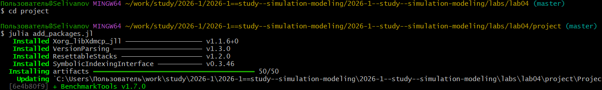
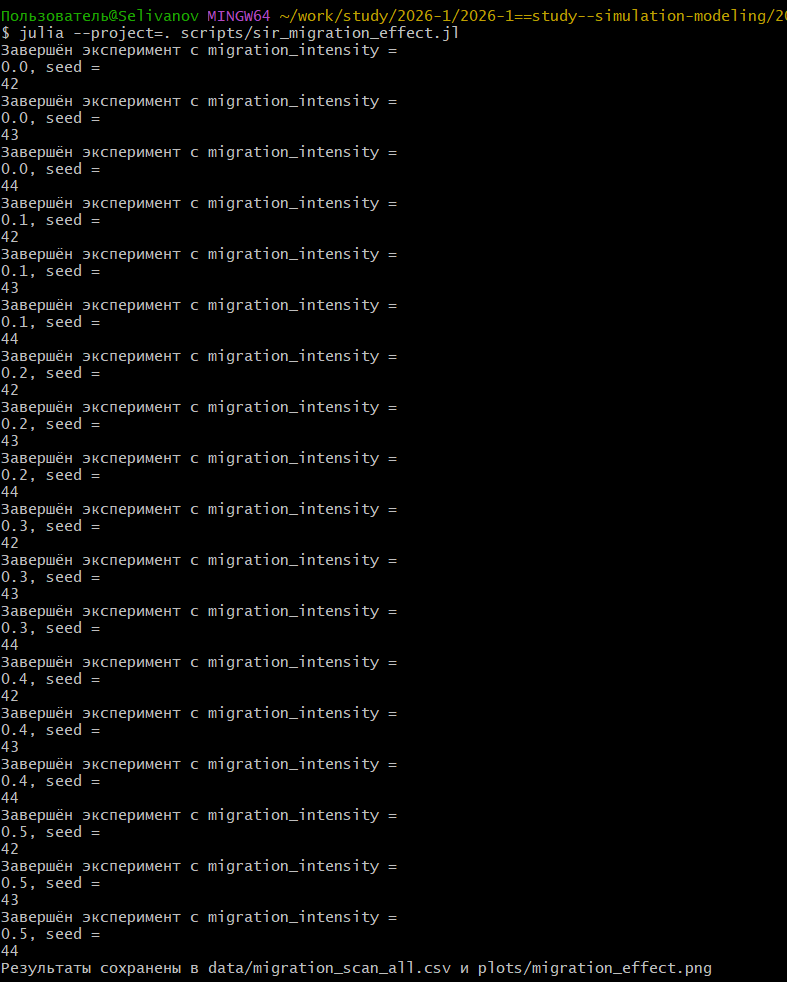
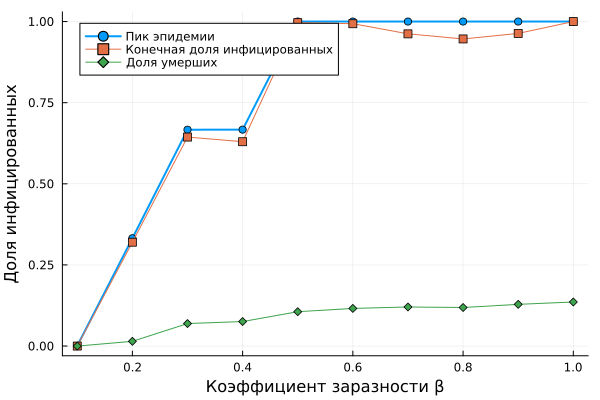

---
## Author
author:
  name: Селиванов Вячеслав Алексеевич
  degrees: DSc
  orcid: 0000-0002-0877-7063
  email: 1132236027@rudn.ru
  affiliation:
    - name: Российский университет дружбы народов
      country: Российская Федерация
      postal-code: 117198
      city: Москва
      address: ул. Миклухо-Маклая, д. 6
## Title
title: Лабораторная работа №4
subtitle: Реализация основных моделей в агентном подходе
license: CC BY
date: today
date-format: "2026-04-04" # Example: 2025-09-06
---

# Информация

## Докладчик

:::::::::::::: {.columns align=center}
::: {.column width="70%"}

  * Селиванов Вячеслав Алексеевич

:::
::: {.column width="30%"}

:::
::::::::::::::

## Актуальность

- Математическая модели Sir прогнозирует скорость распространения эпидемии

## Объект и предмет исследования

Модель SIR

## Цели и задачи

Создать агентную модель распространения инфекционного заболевания на
основе классической компартментальной модели SIR

## Выполнение лабораторной работы

Создадим проект для лабораторной работы.

## 

Добавляем необходимые пакеты.

## 

Создадим файл с описанием агента, а так же запустим скрипт, визуализирующий базовый эксперимент.

## 

Запустим скрипт, анализирующий влияние параметра beta на модель.

## 

Запустим скрипт, анализирующий влияние эффекта миграции.

## 

Запустим скрипт, оптимизирующий параметры для минимизации смертности и заболеваемости.

## 

Запустим скрпит, создающий сводную визуализацию.

## 

Создадим необходимые производные форматы для всех скриптов.

## 

Визуализируем результаты базового эксперимента.

## 

Визуализируем влияние параметра beta.

## 

Визуализируем влияние эффекта миграции.

## Выводы

В ходе данной лабороторной работы я научился применять агентный подход к модели SIR