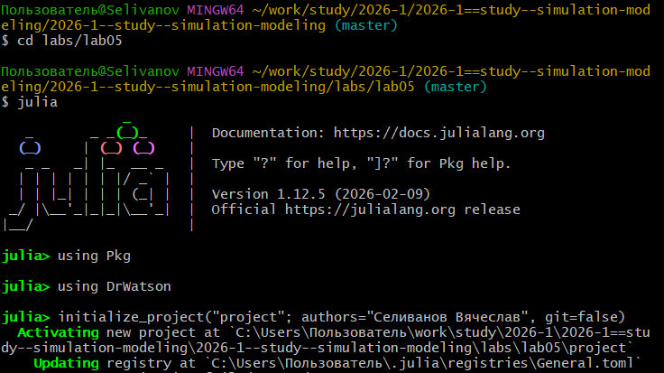
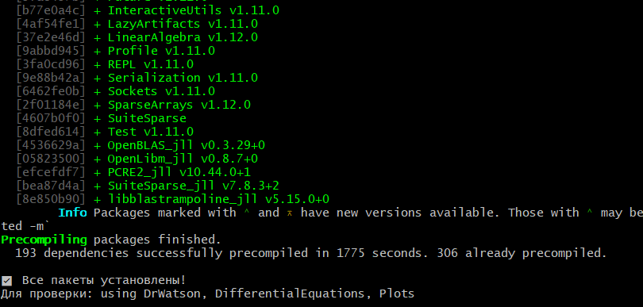
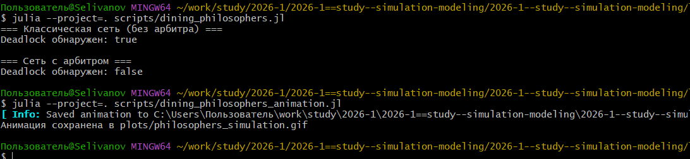
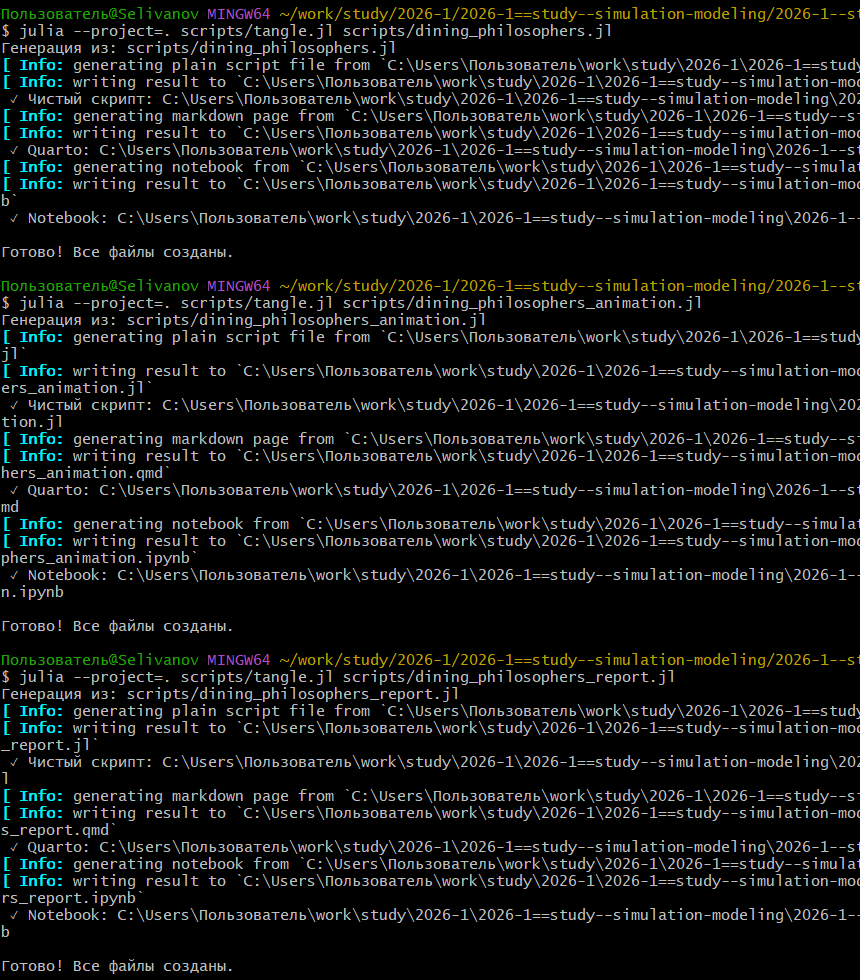
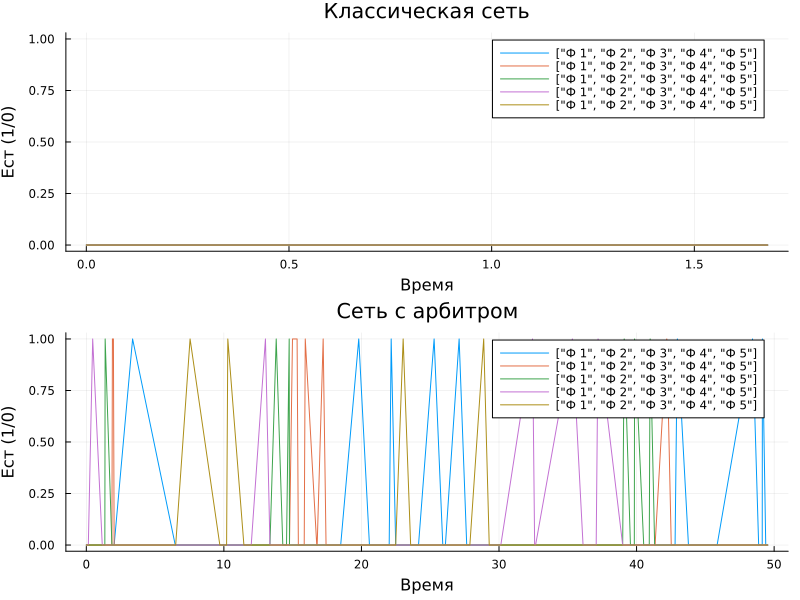

---
## Author
author:
  name: Селиванов Вячеслав Алексеевич
  degrees: DSc
  orcid: 0000-0002-0877-7063
  email: 1132236027@rudn.ru
  affiliation:
    - name: Российский университет дружбы народов
      country: Российская Федерация
      postal-code: 117198
      city: Москва
      address: ул. Миклухо-Маклая, д. 6
## Title
title: Лабораторная работа №4
subtitle: Аппарат сетей Петри
license: CC BY
date: today
date-format: "2026-04-18" # Example: 2025-09-06
---

# Информация

## Докладчик

:::::::::::::: {.columns align=center}
::: {.column width="70%"}

  * Селиванов Вячеслав Алексеевич

:::
::: {.column width="30%"}

:::
::::::::::::::

## Актуальность

- Сеть Петри есть математический аппарат для моделирования дискретных систем. Сегодня является мощным и наглядным математическим аппаратом. Она
незаменима везде, где нужно описать параллельные, асинхронные и распределённые системы. В её основе лежат всего четыре элемента, а богатство поведения
возникает из их комбинации.

## Объект и предмет исследования

Модель "Обедающие философы"

## Цели и задачи

Познакомиться с аппаратом сетей Петри. Рассмотреть сеть Петри на примере абстрактной задачи "Обедающие философы", рассмотреть различные её вариации.

## Выполнение лабораторной работы

Создадим проект для лабораторной работы.

## 

Добавляем необходимые пакеты.

## 

Создадим файл с описанием модели, а так же запустим скрипт, визуализирующий базовый эксперимент (без арбитра и с арбитром).

## 

Запустим скрипт, анимирующий поведение модели во времени.

## 

Запустим скрипт, визуализирующий финальный отчет о поведении модели с арбитром и без.

## 

Создадим необходимые производные форматы для всех скриптов.

## 

Визуализируем результаты финального отчёт.

## Выводы

В ходе данной лабороторной работы я ознакомился с аппаратом сети Петри и поработал с моделью "Обедающие философы".