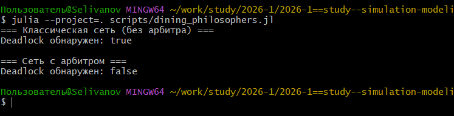
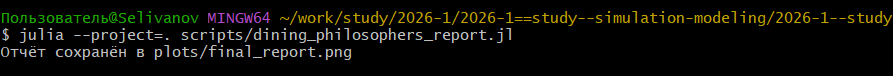

---
## Author
author:
  name: Селиванов Вячеслав Алексеевич
  degrees: DSc
  orcid: 0000-0002-0877-7063
  email: 1132236027@rudn.ru
  affiliation:
    - name: Российский университет дружбы народов
      country: Российская Федерация
      postal-code: 117198
      city: Москва
      address: ул. Миклухо-Маклая, д. 6

## Title
title: "Отчёт по лабораторной работе №5"
subtitle: "Аппарат сетей Петри"
license: "CC BY"
---

# Цель работы

Познакомиться с аппаратом сетей Петри

# Задание

Рассмотреть сеть Петри на примере абстрактной задачи "Обедающие философы", рассмотреть различные её вариации. 

# Теоретическое введение

Сеть Петри есть математический аппарат для моделирования дискретных систем.
Графически она представляется как двудольный ориентированный граф двух
типов вершин: позиции (круги) и переходы (прямоугольники).
— Позиции (Places) суть пассивные элементы, описывающие состояние системы
(например, наличие ресурса или выполнение условия).
— Внутри позиции могут находиться фишки (tokens) — неотрицательное целое
число, указывающее на количество ресурсов.
— Переходы (Transitions) суть активные элементы, описывающие события или
действия системы.
— Они могут срабатывать, изменяя состояние модели.
— Дуги (Arcs) суть направленные соединения между позициями и переходами
(но не между двумя позициями или двумя переходами), которые показывают,
как состояние влияет на события и наоборот.
— Маркировка (Marking) есть распределение фишек по позициям в определённый момент времени, то есть текущее состояние модели.
— Смена маркировок происходит при срабатывании переходов в соответствии
с определёнными правилами.
Теория сетей Петри, появившаяся как инструмент для анализа химических процессов, сегодня является мощным и наглядным математическим аппаратом. Она
незаменима везде, где нужно описать параллельные, асинхронные и распределённые системы. В её основе лежат всего четыре элемента, а богатство поведения
возникает из их комбинации.
В основе сети Петри лежит двудольный ориентированный мультиграф — это означает, что вершины в ней делятся на два типа, дуги всегда соединяют вершины
разных типов, и между двумя вершинами может быть несколько дуг.

# Выполнение лабораторной работы

Создадим проект для лабораторной работы ([рис. @fig-001]).

{#fig-001 width=70%}

Добавляем необходимые пакеты ([рис. @fig-002]).

{#fig-002 width=70%}

Создадим файл с описанием модели, а так же запустим скрипт, визуализирующий базовый эксперимент (без арбитра и с арбитром) ([рис. @fig-003]).

{#fig-003 width=70%}

Запустим скрипт, анимирующий поведение модели во времени ([рис. @fig-004]).

{#fig-004 width=70%}

Запустим скрипт, визуализирующий финальный отчет о поведении модели с арбитром и без ([рис. @fig-005]).

{#fig-005 width=70%}

Создадим необходимые производные форматы для всех скриптов ([рис. @fig-006]).

{#fig-006 width=70%}





# Выводы

В ходе данной лабороторной работы я ознакомился с аппаратом сети Петри и поработал с моделью "Обедающие философы".

# Список литературы{.unnumbered}

::: {#Текст Лабораторной работы №5}
:::